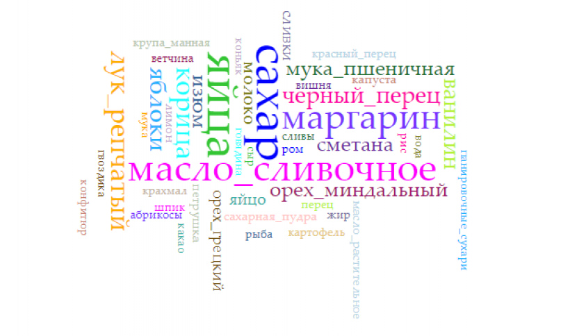

# Начинка для пирога: частота встречаемости ингредиентов в рецептах пирогов

  Пироги - одни из главный традиционных русских блюд. Издревле на Руси подчевали дорогих гостей разнообразными пирогами и пирожками - сладкими и солёными, закрытыми и открытыми, мясными и овощными. Впервые о пирогах в своих заметках упоминал известный немецкий путешественник Адам Олеарий. Он был поражен поразительным вкусом русских пирогов и их невероятным многообразием начинок.  Действительно, русская кухня отличается изобилием вкусов. Ни у одного народа не существует такого количества форм и вариантов пирогов, как в России. В начинку принято добавлять совершенно любые продукты, которыми только можно найти под рукой. 
  
  Опуская обширную предысторию развития и совершенствования рецептов пирогов, перейдём непосредственно к предмету проекта, коим является начинка. Преступая к выполнению проекты, мы задали себе вопросы, на которые вследствие пытались найти ответы: Какой ингредиент чаще всего встречается в рецептах? Какие сочетания продуктов самые популярные? Какие пироги наиболее распространёны в литературных произведениях? 
  
  Целью нашего проекта является сравнительный анализ начинок для пирогов и пирожков. Для работы мы использовали три иструмента: НКРЯ, Dephi, Voyant Tools.
  
**1.	Какой ингредиент чаще всего встречается в рецептах? (Voyant tools)**

[Ссылка на работу](https://voyant-tools.org/?corpus=6641927f4db02a0cba71a2f4386dcad5) 

  В данной программе видно, что не одни яйца не являются самым распространенным продуктом: сахар встречается с такой же частотой (25 раз). Первые пять наиболее часто встречающихся в рецептах продуктов (сахар, яйца, сливочное масло, маргарин и корица) – это базовые продукты, обычно использующиеся для связывания основных ингредиентов начинки или усиления вкуса (т.е. приправы). Тоже самое можно наблюдать и в таблице коллокатов: самые часто встречающиеся пары продуктов – маргарин/сахар (20 раз), сахар/корица (14 раз), яйца/сахар (13 раз). Интересно, что в наименее часто встречающихся парах ингредиентов (1 раз) обязательным являются яйца, а вторые ингредиенты – обычно продукты, которые чаще едят как самостоятельное блюдо или которые бывают нечасто и не у всех.
  
**2.	Какие сочетания продуктов самые популярные? (Dephi)**

  На основе книги рецептов "Выпечка" нами было отобрано 67 рецептов пирогов и пирожков, после чего для были составлены "пары" - ингредиенты, встречающиеся в одном рецепте. Например, рецепт, влкючающий в себя ингредиенты «Капуста, яйца, масло сливочное» разбивался на три пары: капуста-яйца, капуста-масло сливочное, яйца-масло сливочное». Подобные пары выбирались из 67 рецептов, пары были подсчитаны, и на основе полученных данных был создан граф. Данный граф, представленный в другом репозитории ([ссылка](https://guskovaas17.github.io/network_pirogi/)), отражает связи между ингредиентами. 
  
  Можно заметить большую точку, к которой сходится большинство связей – самый частотный ингредиент – яйца. Они встречаются в большинстве рецептов.
  
  Как отчетливо видно, на графе присутствуют разные цветовые группы: зеленая, синяя, серая, сиреневая, розовая, бирюзовая, оранжевая. Такое деление обусловлено связями между ингредиентами: группы отражают «ближайшее окружение», встречаемость в однотипных рецептах. Так, голубая и сиреневая группы представляет сладкие ингредиенты для пирогов, а зеленая и серая – несладкие. Иногда ингредиенты в рецептах сочетаются, поэтому видно, что при выявлении связей могут появляться ингредиенты из разных цветовых групп. 

**3.	Какие пироги наиболее распространёны в литературных произведениях? (НКРЯ)**

Мы воспользовались лексико-грамматическим поиском в Национальном корпусе русского языка. Для большей точности составим несколько грамматических моделей, по которым будет вестись поиск, так как некоторые из них синонимичны, ср.: пирог с вишней и вишневый пирожок. Что касается лексики, то следует ограничиться немаркированными семантически словами пирог и пирожок, которые в узуальной речи часто заменяют друг друга. Мы не будем рассматривать другие синонимы слова пирог, так как они не могут быть полными синонимами: ср.: можно сказать: пирог с яблоками, пирог с мясом, но: шарлотка с яблоками, беляш с мясом, сказать *шарлотка с мясом, *беляш с яблоками - нельзя.
Итак, предмет нашего исследования - тексты, в которых встречается одна из четырех грамматических моделей со значением "пирог с какой-либо начинкой, а именно":

1.Пирог (существительное) + с (предлог) + существительное в Т.п. на расстоянии от 1 до 3. Выбор расстояния позволяет включить тексты, в которых начинка обозначается прилагательным(и) и существительным в Т.п. (пирог с крыжовенной начинкой).

2.Пирог (существительное) + прилагательное (относительное) на расстоянии от -1 до 1.

3.Пирожок (существительное) + с (предлог) + существительное в Т.п. на расстоянии от 1 до 3.

4.Пирожок (существительное) + прилагательное (относительное) на расстоянии от -1 до 1.

Далее обозначим эти модели соответственно М1, М2, М3, М4.
* М1: самые популярные начинки - капуста (174 вхождения), мясо (52) и каша (32).
* М2: самые популярные пироги - яблочные (90), капустные (15) и мясные (11).
* М3: самые популярные начинки - капуста (75), мясо (67) и картошка (23).
* М4: самые популярные пирожки - мясные (10), медовые (5) и картофельные (4).

Выводы: 
* Наиболее популярные начинки для пирогов в России - капуста и мясо.
* Популярной начинкой является картофель, при этом чаще встречаются пирожки с картофелем, чем пироги, что говорит о неполной синонимичности этих понятий.
* Распространенной начинкой являются яблоки. Однако высокая доля вхождения в М2 скорее объясняется тяготением русского языка к управлениям, нежели к согласованиям.
* С социальной точки зрения полученные выводы можно объяснить распространением этих продуктов в России и их дешевизной.
* В целом культура печения пирогов в России развита хорошо: по каждой из моделей было найдено более 100 вхождений, конкордансы разнообразны (что говорит о многообразии начинок).

Бонус: самые экзотические пироги, встретившиеся нам в НКРЯ:
* С человечьим мясом (Ф.В. Булгарин. Димитрий Самозванец. 1830);
* С клевером (А. Маслов. Россия в Средней Азии. 1885);
* С устрицами (А. Пятигорский. Древний человек в городе. 2001).
* С икрой (И. Шмелев. Человек из ресторана. 1911).
* С дерьмом (В. Пелевин. Любовь к трем цукербринам. 2014).

проект делали: Гуськова Алена, Карпенюк Вероника, Солдатова Глафира

